# bp_toolkit + UAssetGUI/UAssetAPI - Offline Asset Manipulation

**Location:** `bp_toolkit/` (git submodule)
**Language:** Python 3.8+ (scripts), C# .NET 8 (UAssetAPI)
**Dependencies:** No external Python dependencies; .NET 8 for UAssetGUI

bp_toolkit is an offline asset manipulation system that works without the Unreal Editor
running. It converts `.uasset` binary files to JSON via UAssetGUI, manipulates them with
Python, and converts back. This is a completely separate execution path from the live
gRPC tools.

## Full Architecture Diagram

```mermaid
classDiagram
    direction TB

    %% =============================================
    %% MCP Integration Layer
    %% =============================================

    class BpToolkitService["bp_toolkit.py (14 MCP tools)"] {
        <<ServiceModule>>
        +execute(client, tool_name, args) str
        -_find_bp_toolkit() Optional~Path~
        -_handle_export_asset(args) dict
        -_handle_import_asset(args) dict
        -_handle_detect_type(args) dict
        -_handle_get_info(args) dict
        -_handle_list_properties(args) dict
        -_handle_get_property(args) dict
        -_handle_set_property(args) dict
        -_handle_clone_asset(args) dict
        -_handle_list_graphs(args) dict
        -_handle_add_comment(args) dict
        -_handle_clone_node(args) dict
        -_handle_find(args) dict
        -_handle_query(args) dict
        -_handle_parse(args) dict
    }

    %% =============================================
    %% Python Scripts Layer
    %% =============================================

    class AssetModifier["AssetModifier (bp_builder.py, 1272 lines)"] {
        -path: Path
        -data: dict (loaded JSON)
        -_namemap_set: set
        -_import_cache: dict
        +asset_type: str
        __NameMap Operations__
        +get_name_index(name) int
        +add_name(name) int
        __Import Operations__
        +find_import(class_name) int
        +list_imports() List
        +add_import(class_name, outer, package) int
        +add_package_import(package_name) int
        __Export Operations__
        +get_export(index) dict
        +get_export_by_name(name) dict
        +add_export(export_data) int
        +find_exports_by_class(class_name) List
        __Graph Operations__
        +list_graphs() List
        +find_graph(name) dict
        +get_graph_nodes(graph) List
        +add_node_to_graph(graph, node_export_idx) bool
        __Node Operations__
        +list_nodes() List
        +get_node_property(node, prop_name) Any
        +set_node_property(node, prop_name, value) bool
        __Comment Operations__
        +add_comment(graph_name, text, x, y, w, h) int
        +modify_comment(node_name, text, x, y, w, h) bool
        __Clone Operations__
        +clone_node(node_name, offset_x, offset_y) int
        +clone_asset(new_name, new_folder, output_path) Path
        __Property Path Operations__
        +get_property(path, export_idx) Any
        +set_property(path, value, export_idx) bool
        +list_properties(export_idx) List
        __I/O__
        +save(output_path) Path
        +fix_metadata() bool
    }

    class AssetParser["asset_parser.py"] {
        <<functions>>
        +detect_asset_type(data) str
        +find_in_asset(data, pattern) List~dict~
        +query_asset(json_path, query_type, pattern) Any
        +get_export_classes(data) List~str~
        -extract_events(data) List
        -extract_functions(data) List
        -extract_tasks(data) List
        -extract_decorators(data) List
        -extract_nodes(data) List
        -extract_connections(data) List
        -extract_expressions(data) List
        -extract_emitters(data) List
        -extract_property(export, path) Any
    }

    class AssetType["AssetType constants"] {
        <<constants>>
        BLUEPRINT
        ANIM_BLUEPRINT
        WIDGET_BLUEPRINT
        BEHAVIOR_TREE
        PCG_GRAPH
        MATERIAL
        METASOUND
        NIAGARA_MODULE
        NIAGARA_SYSTEM
        DATA_ASSET
        UNKNOWN
    }

    class BpParser["bp_parser.py"] {
        <<functions>>
        +parse_blueprint(json_path, output_dir, gen_mermaid) dict
        -extract_function_reference(node) str
        -extract_comments(data) List
        -categorize_namemap(names) dict
        -extract_call_graph(nodes) List
    }

    class BpExport["bp_export.py"] {
        <<functions>>
        +export_uasset_to_json(uasset, json, version, mappings) tuple
        +import_json_to_uasset(json, uasset, version, mappings) tuple
        +get_uassetgui_path() Path
        +check_uassetgui() tuple
        +batch_export(paths, output_dir, version) List
        +batch_import(paths, output_dir, version) List
    }

    class BpBatch["bp_batch.py"] {
        <<functions>>
        +find_json_files(paths, recursive) List~Path~
        +process_batch(files, output, gen_mermaid) List~dict~
        +generate_batch_report(results, output_dir)
    }

    class PropertyHelpers["Property Type Templates"] {
        <<functions in bp_builder.py>>
        +make_int_property(name, value) dict
        +make_str_property(name, value) dict
        +make_float_property(name, value) dict
        +make_double_property(name, value) dict
        +make_bool_property(name, value) dict
        +make_name_property(name, value) dict
        +make_guid_property(name, guid) dict
        +make_object_property(name, index) dict
    }

    BpToolkitService --> AssetModifier : lazy import
    BpToolkitService --> AssetParser : lazy import
    BpToolkitService --> BpParser : lazy import
    BpToolkitService --> BpExport : lazy import
    AssetModifier ..> AssetParser : detect_asset_type
    AssetModifier ..> PropertyHelpers : creates property dicts
    AssetParser --> AssetType : uses constants
    BpBatch --> BpParser : calls parse_blueprint
    BpParser ..> AssetParser : uses extract functions

    %% =============================================
    %% UAssetGUI CLI
    %% =============================================

    class UAssetGUI["UAssetGUI.exe (.NET 8 CLI)"] {
        <<external binary>>
        +tojson source dest version
        +fromjson source dest version
    }

    BpExport --> UAssetGUI : subprocess call

    %% =============================================
    %% UAssetAPI Library (C# .NET 8)
    %% =============================================

    class UAsset["UAsset"] {
        <<INameMap>>
        +NameMap: List~FString~
        +Imports: List~Import~
        +Exports: List~Export~
        +CustomVersionContainer: List~CustomVersion~
        +PackageFlags: EPackageFlags
        +HasUnversionedProperties: bool
        +FolderName: string
        +AddNameReference(FString) int
        +SearchNameReference(FString) int
        +GetNameReference(int) FString
        +Read(AssetBinaryReader)
        +Write(AssetBinaryWriter)
    }

    class Import["Import"] {
        +ObjectName: FName
        +OuterIndex: FPackageIndex
        +ClassPackage: FName
        +ClassName: FName
        +PackageName: FName
        +bImportOptional: bool
    }

    class Export["Export (base)"] {
        +ObjectName: FName
        +ClassIndex: FPackageIndex
        +OuterIndex: FPackageIndex
        +SuperIndex: FPackageIndex
        +TemplateIndex: FPackageIndex
        +ObjectFlags: EObjectFlags
        +SerialSize: long
        +Extras: byte[]
        +Dependencies: List~FPackageIndex~[]
    }

    class NormalExport["NormalExport"] {
        +Data: List~PropertyData~
        +ObjectGuid: Guid?
        +SerializationControl: EClassSerializationControlExtension
    }

    class StructExport["StructExport"] {
        +SuperStruct: FPackageIndex
        +Children: FPackageIndex[]
        +LoadedProperties: FProperty[]
        +ScriptBytecode: KismetExpression[]
        +ScriptBytecodeRaw: byte[]
    }

    class ClassExport["ClassExport"] {
        +ClassFlags: EClassFlags
        +FuncMap: TMap~FName, FPackageIndex~
        +Interfaces: InterfaceReference[]
        +ClassDefaultObject: FPackageIndex
        +ClassWithin: FPackageIndex
    }

    class FunctionExport["FunctionExport"] {
        <<function-specific overrides>>
    }

    class PropertyData["PropertyData (abstract)"] {
        +Name: FName
        +ArrayIndex: int
        +PropertyGuid: Guid?
        +IsZero: bool
        +PropertyTagFlags: EPropertyTagFlags
        +PropertyTypeName: FPropertyTypeName
    }

    class NumericProps["Numeric Properties"] {
        IntPropertyData
        Int8PropertyData / Int16PropertyData / Int64PropertyData
        UInt16PropertyData / UInt32PropertyData / UInt64PropertyData
        FloatPropertyData
        DoublePropertyData
        BytePropertyData (+EnumData)
        BoolPropertyData
    }

    class StringProps["String Properties"] {
        StrPropertyData
        NamePropertyData
        TextPropertyData (+Culture, +TextHistory)
    }

    class ObjectProps["Object Reference Properties"] {
        ObjectPropertyData (Value: FPackageIndex)
        SoftObjectPropertyData (Value: FSoftObjectPath)
        ClassPropertyData (Value: FPackageIndex)
        WeakObjectPropertyData (Value: FPackageIndex)
        InterfacePropertyData
    }

    class CollectionProps["Collection Properties"] {
        ArrayPropertyData (+ArrayType, +Value: List~PropertyData~)
        MapPropertyData (+KeyType, +ValueType, +Keys, +Values)
        SetPropertyData (+ElementType, +Value: List~PropertyData~)
    }

    class StructPropertyData["StructPropertyData"] {
        +StructType: string
        +Value: List~PropertyData~ (nested properties)
    }

    class EnumPropertyData["EnumPropertyData"] {
        +EnumType: string
        +Value: FName
    }

    class FName["FName"] {
        +Value: FString
        +DummyValue: FString
        +Index: int
        +Number: int
        +Type: EMappedNameType
        +Asset: INameMap
        +FromString(asset, string)$ FName
    }

    class FPackageIndex["FPackageIndex"] {
        +Index: int
        +IsImport() bool  (negative index)
        +IsExport() bool  (positive index)
        +IsNull() bool    (zero)
        +ToImport(asset) Import
        +ToExport(asset) Export
    }

    class MainSerializer["MainSerializer"] {
        +Read(reader, propertyName) PropertyData
        +Write(data, writer)
        +ReadFProperty(reader) FProperty
        +GenerateUnversionedHeader()
    }

    class KismetSerializer["KismetSerializer"] {
        <<Blueprint VM bytecode>>
        +ReadExpression() KismetExpression
        +WriteExpression()
    }

    class JsonConverters["JSON Converters"] {
        FNameJsonConverter
        FNameTypeConverter (dict key fix)
        FPackageIndexJsonConverter
        TMapJsonConverter
        ByteArrayJsonConverter
        GuidJsonConverter
    }

    class AssetBinaryReader["AssetBinaryReader"] {
        +ReadFName() FName
        +ReadFString() FString
        +ReadInt32() int
    }

    class AssetBinaryWriter["AssetBinaryWriter"] {
        +WriteFName(FName)
        +WriteFString(FString)
        +WriteInt32(int)
    }

    %% =============================================
    %% Filesystem
    %% =============================================

    class UAssetFiles[".uasset / .uexp (UE binary format)"] {
        <<binary on disk>>
    }

    class JsonFiles[".json (UAssetAPI intermediate)"] {
        <<text on disk>>
    }

    %% Relationships
    UAssetGUI --> UAsset : uses

    UAsset "1" o-- "*" Import : Imports list
    UAsset "1" o-- "*" Export : Exports list
    UAsset "1" o-- "*" FName : NameMap

    NormalExport --|> Export
    StructExport --|> NormalExport
    ClassExport --|> StructExport
    FunctionExport --|> StructExport

    NormalExport "1" o-- "*" PropertyData : Data array

    NumericProps --|> PropertyData
    StringProps --|> PropertyData
    ObjectProps --|> PropertyData
    CollectionProps --|> PropertyData
    StructPropertyData --|> PropertyData
    EnumPropertyData --|> PropertyData
    StructPropertyData "1" o-- "*" PropertyData : nested Value

    Import --> FName : ObjectName
    Import --> FPackageIndex : OuterIndex
    Export --> FName : ObjectName
    Export --> FPackageIndex : ClassIndex, OuterIndex, SuperIndex
    PropertyData --> FName : Name

    MainSerializer --> PropertyData : creates/writes
    StructExport --> KismetSerializer : bytecode
    UAsset --> JsonConverters : JSON round-trip
    UAsset --> MainSerializer : binary serialization
    UAsset --> AssetBinaryReader : reads from
    UAsset --> AssetBinaryWriter : writes to

    AssetBinaryReader --> UAssetFiles : reads
    AssetBinaryWriter --> UAssetFiles : writes
    JsonConverters --> JsonFiles : reads/writes
    AssetModifier --> JsonFiles : loads/saves
```



## Pipeline

```
.uasset (binary)
    |
    | UAssetGUI.exe tojson
    v
.json (UAssetAPI format)
    |
    | AssetModifier (Python)
    | - get_property / set_property
    | - add_comment / clone_node
    | - clone_asset
    v
.json (modified)
    |
    | UAssetGUI.exe fromjson
    v
.uasset (modified binary)
```

## UAssetAPI JSON Schema

### Top-Level Structure

```json
{
  "$type": "UAssetAPI.UAsset, UAssetAPI",
  "NameMap": ["string1", "string2", ...],
  "Imports": [...],
  "Exports": [...],
  "DependsMap": [[...], ...],
  "CustomVersionContainer": [...],
  "FolderName": "/Game/MyFolder",
  "PackageGuid": "{GUID}"
}
```

### Index Convention

- **Positive** integer = Export index (0-based)
- **Negative** integer = Import index (-1 = Imports[0], -2 = Imports[1], ...)
- **Zero** = null reference

### Export Structure

```json
{
  "$type": "UAssetAPI.ExportTypes.NormalExport, UAssetAPI",
  "ObjectName": "MyObject",
  "ClassIndex": -13,
  "OuterIndex": 3,
  "SuperIndex": 0,
  "ObjectFlags": "RF_Transactional",
  "Data": [
    { "$type": "...IntPropertyData...", "Name": "MyInt", "Value": 42 },
    { "$type": "...StrPropertyData...", "Name": "MyStr", "Value": "hello" },
    { "$type": "...StructPropertyData...", "Name": "MyStruct",
      "StructType": "Vector", "Value": [...] }
  ],
  "Extras": "AAAAAA=="
}
```

### Property Path Access

```python
asset = AssetModifier("MyAsset.json")

# Simple property
asset.get_property("BiomePriority")

# Nested struct
asset.get_property("BiomeDefinition.BiomePriority")

# Array element with field
asset.get_property("BiomeAssets[0].Generator")

# Set value
asset.set_property("BiomePriority", 5)
asset.save()
```

## Live vs Offline Tools

| Aspect | Live (gRPC) | Offline (bp_toolkit) |
|--------|-------------|----------------------|
| **Editor required** | Yes | No |
| **Blueprint editing** | Create nodes, connect pins | Clone nodes, add comments |
| **PCG editing** | Add/connect/delete nodes | Modify properties |
| **Speed** | Milliseconds | Seconds (export/import) |
| **K2Node pins** | Full access | Opaque (Extras blob) |
| **Use case** | Interactive editing | CI/CD, batch processing, analysis |

## Known Limitations

| Limitation | Cause | Workaround |
|-----------|-------|-----------|
| K2Node pins in binary | Stored in Extras byte[] | Clone existing nodes (preserves Extras) |
| FName dict keys | UAssetAPI JSON deserialization | Fixed in UAssetAPI fork |
| UE 5.6 unversioned props | Requires .usmap mappings | Use versioned serialization |
| Large JSON files | 40-100MB for complex BPs | Gitignored by default |

## Files

| File | Lines | Purpose |
|------|-------|---------|
| `bp_builder.py` | 1272 | `AssetModifier` class |
| `asset_parser.py` | ~800 | Type detection, multi-asset queries |
| `bp_parser.py` | ~500 | Blueprint analysis, call graphs |
| `bp_export.py` | ~250 | UAssetGUI wrapper |
| `bp_batch.py` | 238 | Bulk processing |
| `mcp/services/bp_toolkit.py` | ~300 | MCP integration (14 tools) |

### UAssetAPI (vendor)

| Component | Language | Purpose |
|-----------|----------|---------|
| `UAssetAPI/` | C# | Binary format parser/writer library |
| `UAssetGUI/` | C# | CLI wrapper around UAssetAPI |
| `.NET 8 runtime` | - | Required for execution |
| `Newtonsoft.Json` | C# | JSON serialization |
| `ZstdSharp` | C# | Compression support |
