# AgentBridgeCore - Reflection Primitives

**Plugin:** `AgentBridgeCore/`
**Dependencies:** Core, CoreUObject, Engine (UE modules only)
**Depended on by:** Runtime, Scripting, Server (all other AgentBridge modules)

AgentBridgeCore provides low-level reflection utilities for reading/writing UE properties
and invoking functions dynamically. It has zero dependencies on other AgentBridge plugins
and serves as the foundation layer.

## Class Diagram

```mermaid
classDiagram
    direction TB

    class FAgentBridgeCoreModule {
        <<IModuleInterface>>
        +StartupModule()
        +ShutdownModule()
    }

    class FPropertyAccessor {
        <<static>>
        +ReadProperty(Container, Property, MaxDepth)$ FAgentPropertyValue
        +WriteProperty(Container, Property, Value)$ bool
        +WritePropertyDirect(ValuePtr, Property, Value)$ bool
        +GetPropertyType(Property)$ EAgentPropertyType
        +GetPropertyTypeName(Property)$ FString
        +IsPropertyWritable(Property)$ bool
        +GetPropertyDisplayName(Property)$ FString
        +SerializeObjectReference(UObject*)$ FString
        +ResolveObjectReference(FString)$ UObject*
        -ReadBoolProperty()$
        -ReadNumericProperty()$
        -ReadStringProperty()$
        -ReadEnumProperty()$
        -ReadObjectProperty()$
        -ReadStructProperty()$
        -ReadArrayProperty()$
        -ReadMapProperty()$
        -ReadSetProperty()$
        -TryReadSpecialStruct()$
        -WriteBoolProperty()$
        -WriteNumericProperty()$
        -WriteStructProperty()$
        -WriteArrayProperty()$
        -TryWriteSpecialStruct()$
    }

    class FAgentPropertyPath {
        <<static>>
        +ParsePath(string)$ TArray~FPropertyPathSegment~
        +SegmentsToString(segments)$ FString
        +ValidatePath(Object, path)$ bool
        +GetValue(Object, path)$ FPropertyPathResult
        +SetValue(Object, path, value)$ bool
        +PathExists(Object, path)$ bool
        +GetPathType(Object, path)$ EAgentPropertyType
        -ResolveSegments()$
        -FindPropertyByName()$
    }

    class FTypeDiscovery {
        <<static>>
        +FindClassByName(name)$ UClass*
        +GetAllClassesOfType(BaseClass)$ TArray~UClass*~
        +GetClassInfo(UClass*)$ FAgentClassInfo
        +GetClassProperties(UClass*)$ TArray~FAgentPropertyInfo~
        +GetClassFunctions(UClass*)$ TArray~FAgentFunctionSignature~
        +FindStructByName(name)$ UScriptStruct*
        +GetStructProperties(UScriptStruct*)$ TArray~FAgentPropertyInfo~
        +FindEnumByName(name)$ UEnum*
        +GetEnumValues(UEnum*)$ TArray~FAgentEnumValue~
        +NormalizeClassName(name)$ FString
        +GetDisplayClassName(UClass*)$ FString
        +IsBlueprintClass(UClass*)$ bool
        +GetClassPath(UClass*)$ FString
        -BuildPropertyInfo(FProperty*)$ FAgentPropertyInfo
        -BuildFunctionSignature(UFunction*)$ FAgentFunctionSignature
    }

    class FFunctionInvoker {
        <<static>>
        +GetCallableFunctions(UClass*)$ TArray~UFunction*~
        +FindFunction(UClass*, name)$ UFunction*
        +GetFunctionSignature(UFunction*)$ FAgentFunctionSignature
        +FunctionNeedsWorldContext(UFunction*)$ bool
        +GetWorldContextParamName(UFunction*)$ FString
        +FunctionHasHiddenSelfPin(UFunction*)$ bool
        +InvokeFunction(Target, Function, Params)$ FAgentFunctionResult
        +InvokeStaticFunction(Class, Function, Params)$ FAgentFunctionResult
        -PrepareParameters()$
        -ExtractResults()$
        -CleanupParameters()$
        -FindParameterByName()$
    }

    class EAgentPropertyType {
        <<enum>>
        None
        Bool
        Int8  Int16  Int32  Int64
        UInt8 UInt16 UInt32 UInt64
        Float  Double
        String  Name  Text
        Vector  Rotator  Transform  Color
        Object  SoftObject  WeakObject  Class
        Struct  Enum  Array  Map  Set
        Unknown
    }

    class FAgentPropertyValue {
        <<universal transport struct>>
        +Type: EAgentPropertyType
        +StringValue: FString
        +BinaryValue: TArray~uint8~
        +ArrayValue: TArray~TSharedPtr~FAgentPropertyValue~~
        +StructValue: TMap~FString,TSharedPtr~FAgentPropertyValue~~
        +FromBool(v)$ FAgentPropertyValue
        +FromInt(v)$ FAgentPropertyValue
        +FromFloat(v)$ FAgentPropertyValue
        +FromString(v)$ FAgentPropertyValue
        +FromVector(v)$ FAgentPropertyValue
        +FromRotator(v)$ FAgentPropertyValue
        +FromTransform(v)$ FAgentPropertyValue
        +FromObject(v)$ FAgentPropertyValue
        +AsBool() bool
        +AsInt() int64
        +AsFloat() double
        +AsString() FString
        +AsVector() FVector
        +AsRotator() FRotator
        +AsTransform() FTransform
    }

    class FAgentPropertyInfo {
        <<struct>>
        +PropertyName: FString
        +DisplayName: FString
        +Type: EAgentPropertyType
        +TypeName: FString
        +ElementType: FString
        +KeyType: FString
        +bIsReadOnly: bool
        +bIsEditorOnly: bool
        +Category: FString
        +Description: FString
    }

    class FAgentClassInfo {
        <<struct>>
        +ClassName: FString
        +DisplayName: FString
        +ClassPath: FString
        +bIsBlueprintClass: bool
        +bIsAbstract: bool
        +ParentClassName: FString
        +ImplementedInterfaces: TArray~FString~
    }

    class FAgentFunctionSignature {
        <<struct>>
        +FunctionName: FString
        +Parameters: TArray~FAgentPropertyInfo~
        +ReturnValue: FAgentPropertyInfo
        +bIsStatic: bool
        +bIsBlueprintCallable: bool
        +bNeedsWorldContext: bool
        +Description: FString
    }

    class FAgentFunctionResult {
        <<struct>>
        +bSuccess: bool
        +ErrorMessage: FString
        +ReturnValue: FAgentPropertyValue
        +OutParams: TMap~FString,TSharedPtr~FAgentPropertyValue~~
    }

    class FAgentEnumValue {
        <<struct>>
        +Name: FString
        +DisplayName: FString
        +Value: int64
    }

    class EPropertyPathSegmentType {
        <<enum>>
        None
        Property
        ArrayIndex
        MapKey
    }

    class FPropertyPathSegment {
        <<struct>>
        +Type: EPropertyPathSegmentType
        +Name: FString
        +Index: int32
        +Property(name)$ FPropertyPathSegment
        +ArrayIndex(index)$ FPropertyPathSegment
        +MapKey(key)$ FPropertyPathSegment
    }

    class FPropertyPathResult {
        <<struct>>
        +bSuccess: bool
        +ErrorMessage: FString
        +Value: FAgentPropertyValue
        +ContainerPtr: void*
        +FinalProperty: FProperty*
        +ValuePtr: void*
    }

    %% Relationships
    FAgentPropertyValue --> EAgentPropertyType : typed by
    FAgentPropertyInfo --> EAgentPropertyType : typed by
    FAgentFunctionSignature o-- FAgentPropertyInfo : Parameters and ReturnValue
    FAgentFunctionResult o-- FAgentPropertyValue : ReturnValue
    FPropertyPathSegment --> EPropertyPathSegmentType : typed by
    FPropertyPathResult o-- FAgentPropertyValue : Value for reads

    FAgentPropertyPath --> FPropertyAccessor : uses for read/write
    FAgentPropertyPath ..> FPropertyPathSegment : parses into
    FAgentPropertyPath ..> FPropertyPathResult : returns

    FFunctionInvoker --> FPropertyAccessor : param marshaling
    FFunctionInvoker ..> FAgentFunctionResult : returns
    FFunctionInvoker ..> FAgentFunctionSignature : returns

    FTypeDiscovery ..> FAgentClassInfo : returns
    FTypeDiscovery ..> FAgentPropertyInfo : returns
    FTypeDiscovery ..> FAgentFunctionSignature : returns
    FTypeDiscovery ..> FAgentEnumValue : returns
```



## Key Classes

### FPropertyAccessor (PropertyAccessor.h)

Core low-level property read/write using UE's `FProperty` reflection system. Handles all
property types recursively with configurable depth limits.

**Read path:** `ReadProperty(Container, Property)` dispatches to type-specific readers
(`ReadStructProperty`, `ReadArrayProperty`, etc.) and returns `FAgentPropertyValue`.

**Write path:** Two variants:
- `WriteProperty(Container, Property, Value)` - computes offset internally
- `WritePropertyDirect(ValuePtr, Property, Value)` - takes pre-resolved pointer (used by path resolution to avoid double-offsetting)

**Special struct handling:** `TryReadSpecialStruct()`/`TryWriteSpecialStruct()` provide
optimized paths for FVector, FRotator, FTransform, FColor.

### FAgentPropertyPath (AgentPropertyPath.h)

Parses and resolves dot-notation property paths like `"Components[0].Location.X"`.

**Segment types:**
- `Property` - dot-separated name: `"Location"`
- `ArrayIndex` - bracket index: `"[0]"`
- `MapKey` - quoted bracket: `'["Key"]'`

**Path examples:**
```
Location             -> [Property("Location")]
Location.X           -> [Property("Location"), Property("X")]
Components[0]        -> [Property("Components"), ArrayIndex(0)]
Stats["Strength"]    -> [Property("Stats"), MapKey("Strength")]
Equipment["Weapon"].Damage -> [Property("Equipment"), MapKey("Weapon"), Property("Damage")]
```

### FTypeDiscovery (TypeDiscovery.h)

Class/struct/enum discovery with Blueprint name normalization. Automatically handles `_C`
suffix for Blueprint classes - `FindClassByName("BP_MyActor")` will try `BP_MyActor`,
`BP_MyActor_C`, prefixed variants, and full path loading.

### FFunctionInvoker (FunctionInvoker.h)

Dynamic UFunction invocation with automatic parameter marshaling. Handles hidden parameters
(WorldContext, self) transparently. Currently reliable for zero-arg void functions; full
argument support is deferred.

### FAgentPropertyValue (AgentBridgeTypes.h)

The universal transport container for property values across module boundaries. Primitives
are stored in `StringValue` (serialized), arrays in `ArrayValue`, structs/maps in `StructValue`.
This is the **only** value type that crosses module boundaries - higher layers never see
raw `FProperty` pointers.

## Files

| File | Contents |
|------|----------|
| `Public/AgentBridgeCore.h` | `FAgentBridgeCoreModule` |
| `Public/AgentBridgeTypes.h` | `EAgentPropertyType`, `FAgentPropertyValue`, `FAgentPropertyInfo`, `FAgentClassInfo`, `FAgentFunctionSignature`, `FAgentFunctionResult`, `FAgentEnumValue` |
| `Public/PropertyAccessor.h` | `FPropertyAccessor` |
| `Public/AgentPropertyPath.h` | `EPropertyPathSegmentType`, `FPropertyPathSegment`, `FPropertyPathResult`, `FAgentPropertyPath` |
| `Public/TypeDiscovery.h` | `FTypeDiscovery` |
| `Public/FunctionInvoker.h` | `FFunctionInvoker` |

## Critical Implementation Notes

**Array Traversal:** Use `FScriptArrayHelper::GetRawPtr(i)` - the returned pointer IS the
container for the Inner property. Pass it directly, not the outer container.

**Map Traversal:** Maps have sparse indices. Always check `IsValidIndex(i)` when iterating
`GetMaxIndex()` (not `Num()`).

**Write Variants:** After path resolution, use `WritePropertyDirect()` (pointer pre-resolved).
Using `WriteProperty()` would double-offset and corrupt memory.

**Blueprint Names:** Properties can have GUID suffixes
(`BiomePriority_29_308259B0449F5BA935CCC9B3DBDB97F3`). Path resolution strips these
automatically for matching.
