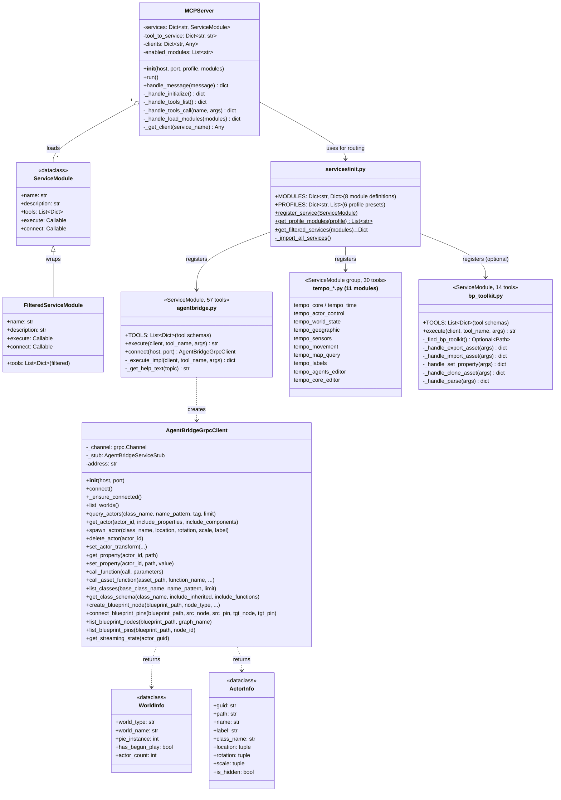

# Python MCP Server - External Agent Interface

**Location:** `mcp/` (git submodule)
**Language:** Python 3.8+
**Dependencies:** grpcio, protobuf (via TempoEnv)

The MCP server is the entry point for external AI agents. It implements the MCP protocol
(JSON-RPC over stdio) and routes tool calls to gRPC services or local Python handlers.

## Class Diagram



## Module & Profile System

### Modules (8 defined)

| Module | Tools | Description |
|--------|-------|-------------|
| `core` | 6 | Help, world listing, console commands |
| `classes` | 17 | Actors, properties, components, transforms, assets |
| `editor` | 7 | PIE, simulate, level management |
| `world_partition` | 7 | Streaming, landscape queries |
| `files` | 4 | Project file I/O |
| `bp_toolkit` | 26 | Blueprint/PCG live + offline tools |
| `tempo_sim` | 28 | Simulation, time, sensors, navigation |

### Profiles (6 presets)

| Profile | Modules | Total Tools | Use Case |
|---------|---------|-------------|----------|
| `core` | core | 6 | Absolute minimum |
| `standard` | core, classes, world_partition | 30 | Default editor work |
| `editor` | core, classes, editor, world_partition, files | 41 | Full editor |
| `scripting` | core, classes, editor, files, bp_toolkit | 60 | With BP/PCG editing |
| `simulation` | core, classes, tempo_sim | 51 | PIE/runtime |
| `full` | all modules | ~100 | Everything |

## Service Registration Pattern

Each service file follows this pattern:

```python
# 1. Define tools
TOOLS = [{"name": "tool_name", "description": "...", "inputSchema": {...}}, ...]

# 2. Define client class
class MyClient:
    def __init__(self, host, port): ...
    def method(self, ...): ...

# 3. Define execute function
def execute(client, tool_name, args):
    result = _execute_impl(client, tool_name, args)
    return json.dumps(result, indent=2)

# 4. Define connect function
def connect(host, port):
    return MyClient(host, port)

# 5. Register
register_service(ServiceModule(name="...", tools=TOOLS, execute=execute, connect=connect))
```

## Request Flow

```
stdin (JSON-RPC) -> MCPServer.run() -> handle_message()
    -> _handle_tools_call(tool_name, args)
    -> tool_to_service[tool_name] -> service_name
    -> _get_client(service_name) -> lazy gRPC client
    -> service.execute(client, tool_name, args)
    -> gRPC call to Unreal Engine
    -> response JSON -> stdout
```

## Configuration

```bash
python -m mcp --host localhost --port 10001 --profile full
```

| Option | Default | Description |
|--------|---------|-------------|
| `--host` | localhost | gRPC server host |
| `--port` | 10001 | gRPC server port |
| `--profile` | full | Profile name |
| `--modules` | (from profile) | Override module list |
| `--debug` | false | Enable debug logging |

## Files

| File | Contents |
|------|----------|
| `mcp/__init__.py` | Package metadata |
| `mcp/__main__.py` | CLI entry point |
| `mcp/server.py` | `MCPServer` class |
| `mcp/client.py` | `AgentBridgeGrpcClient`, dataclasses |
| `mcp/services/__init__.py` | Module registry, profiles |
| `mcp/services/base.py` | Tempo API path detection, utilities |
| `mcp/services/agentbridge.py` | AgentBridge tools (57) |
| `mcp/services/bp_toolkit.py` | Offline asset tools (14) |
| `mcp/services/tempo_*.py` | Tempo service tools (11 files, 30 tools) |
