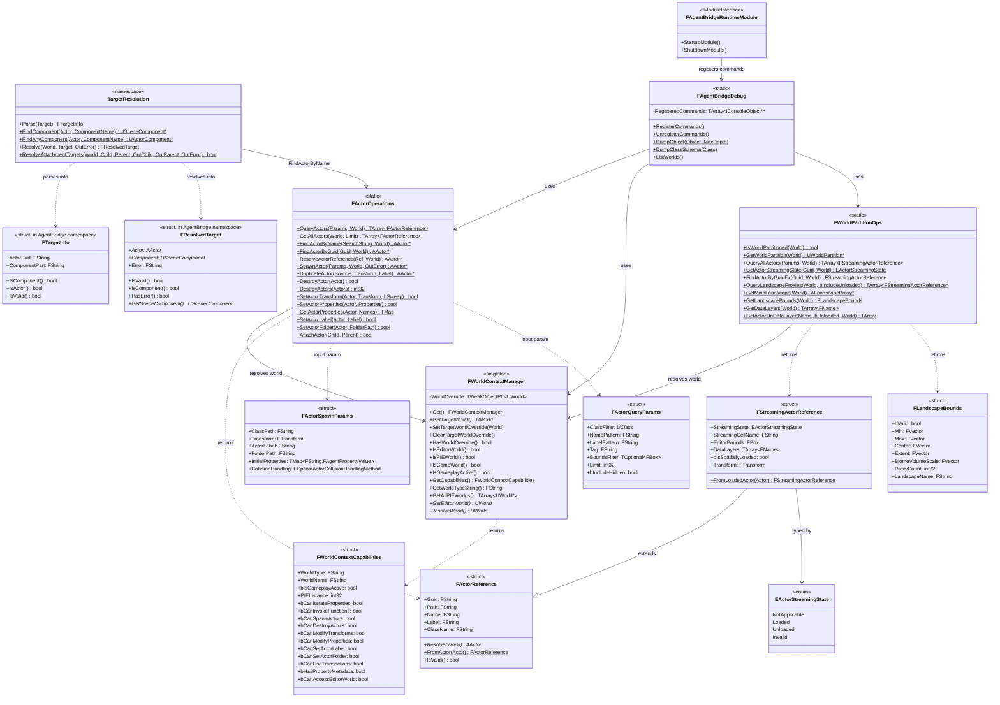

# AgentBridgeRuntime - World Operations

**Plugin:** `AgentBridgeRuntime/`
**Dependencies:** AgentBridgeCore, Core, CoreUObject, Engine, Landscape
**Depended on by:** Scripting, Server

AgentBridgeRuntime provides world context management, actor operations, target resolution,
and World Partition support. It bridges Core's reflection primitives and Scripting's
command dispatch.

## Class Diagram

## Key Classes

### FWorldContextManager (singleton)

Manages which UWorld is the "target" for all operations. Resolution order:
1. Explicit override (set via `SetTargetWorldOverride`)
2. PIE world (if playing)
3. Editor world (fallback)

All Runtime and Scripting operations call `FWorldContextManager::Get().GetTargetWorld()`
to determine which world to operate on.

### FActorOperations (static)

High-level actor CRUD operations. Resolution cascade for `FindActorByName()`:
GUID -> Object Path -> GetName() exact match -> Label exact match -> Name substring -> Label substring.

### TargetResolution (namespace)

Parses the `"Actor->Component"` syntax used by unified transform/attach tools.
`Parse("MyLight->LightComponent0")` returns `FTargetInfo{ActorPart="MyLight", ComponentPart="LightComponent0"}`.
Component search: exact match -> case-insensitive -> partial match.

### FWorldPartitionOps (static)

World Partition-aware operations that can query unloaded actors via actor descriptors.
Essential for large open worlds where most actors are streamed out.

### FAgentBridgeDebug (static)

Registers ~30 console commands (e.g., `AgentBridge.DumpActor`, `AgentBridge.QueryActors`)
for debugging without MCP/gRPC. Useful during development.

## Files

| File | Contents |
|------|----------|
| `Public/AgentBridgeRuntime.h` | `FAgentBridgeRuntimeModule` |
| `Public/WorldContextManager.h` | `FWorldContextManager`, `FWorldContextCapabilities` |
| `Public/ActorOperations.h` | `FActorOperations`, `FActorReference`, `FActorSpawnParams`, `FActorQueryParams` |
| `Public/TargetResolution.h` | `TargetResolution` namespace, `FTargetInfo`, `FResolvedTarget` |
| `Public/WorldPartitionOps.h` | `FWorldPartitionOps`, `FStreamingActorReference`, `EActorStreamingState`, `FLandscapeBounds` |
| `Public/AgentBridgeDebug.h` | `FAgentBridgeDebug` |
