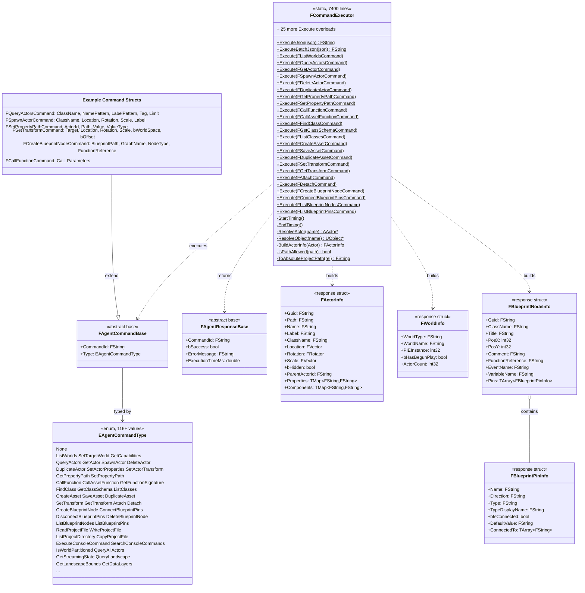

# AgentBridgeScripting - Command Dispatch

**Plugin:** `AgentBridgeScripting/`
**Dependencies:** AgentBridgeCore, AgentBridgeRuntime, Core, CoreUObject, Engine, Json, AssetRegistry, UnrealEd (editor-only)
**Depended on by:** Server

AgentBridgeScripting contains the central command dispatcher (`FCommandExecutor`) and all
command/response structs. It's the thickest layer (~7400 lines in CommandExecutor.cpp) -
all business logic lives here to avoid gRPC header conflicts in the Server module.

## Class Diagram



## Key Design

### FCommandExecutor - The Central Dispatcher

Every gRPC and HTTP request ultimately calls one of `FCommandExecutor`'s 50+ overloaded
`Execute()` methods. Each follows the same pattern:

```cpp
void FCommandExecutor::Execute(const FMyCommand& Cmd, FMyResponse& Response)
{
    StartTiming();

    // 1. Validate inputs
    // 2. Resolve actors/objects
    // 3. Perform operation (delegates to Runtime/Core)
    // 4. Build response

    EndTiming(Response);
}
```

### Actor Resolution

`ResolveActor(name)` tries multiple strategies: GUID, object path, exact name match,
label match, substring match. `ResolveObject(name)` additionally tries loading as an asset
path - this is used for `call_function` which can target assets (like PCG graphs), not
just actors.

### Blueprint Node Operations (WITH_EDITOR)

Blueprint editing is implemented directly in CommandExecutor using UE's `BlueprintGraph`
module APIs:
- Creates `UK2Node_CallFunction`, `UK2Node_Event`, `UK2Node_IfThenElse`, etc.
- Uses `UEdGraphSchema_K2::TryCreateConnection()` for pin connections
- Marks blueprints modified via `FBlueprintEditorUtils`

### PCG Graph Operations

PCG tools route through `FCallAssetFunctionCommand` - they call UFunctions on `UPCGGraph`
objects (e.g., `AddNodeOfType`, `AddEdge`, `RemoveNode`). This works because PCG graphs
expose their editing API as BlueprintCallable UFunctions.

### Command Struct Pattern

All 50+ command structs inherit from `FAgentCommandBase` and set their `Type` in the
constructor. Response structs inherit from `FAgentResponseBase` which provides `bSuccess`,
`ErrorMessage`, and `ExecutionTimeMs`.

## Files

| File | Contents |
|------|----------|
| `Public/AgentBridgeScripting.h` | `FAgentBridgeScriptingModule` |
| `Public/AgentCommands.h` | `EAgentCommandType`, `FAgentCommandBase`, `FAgentResponseBase`, 50+ command structs, info structs (~2400 lines) |
| `Public/CommandExecutor.h` | `FCommandExecutor` declaration (~330 lines) |
| `Private/CommandExecutor.cpp` | `FCommandExecutor` implementation (~7400 lines) |
