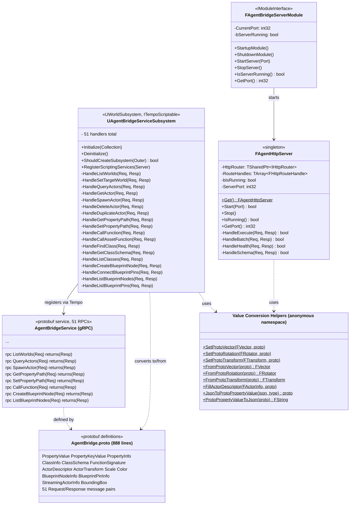

# AgentBridgeServer - Network Layer

**Plugin:** `AgentBridgeServer/`
**Dependencies:** AgentBridgeCore, AgentBridgeRuntime, AgentBridgeScripting, TempoCore
**Depended on by:** None (top of C++ stack)

AgentBridgeServer provides the gRPC and HTTP interfaces. It contains only thin handler
methods and proto definitions - all business logic is in Scripting to avoid gRPC header
conflicts.

## Class Diagram



## Handler Pattern

All 51 gRPC handlers follow identical structure:

```cpp
void UAgentBridgeServiceSubsystem::HandleXxx(
    const XxxRequest& Request,
    const TResponseDelegate<XxxResponse>& ResponseContinuation)
{
    // Step 1: Proto -> Command struct
    FXxxCommand Cmd;
    Cmd.Field = UTF8_TO_TCHAR(Request.field().c_str());

    // Step 2: Execute via CommandExecutor
    FXxxResponse CmdResponse;
    FCommandExecutor::Execute(Cmd, CmdResponse);

    // Step 3: Response struct -> Proto
    XxxResponse Response;
    Response.set_success(CmdResponse.bSuccess);

    // Step 4: Return via callback
    ResponseContinuation.ExecuteIfBound(Response, grpc::Status::OK);
}
```

## Registration

All handlers are registered in a single `RegisterScriptingServices()` call using Tempo's
`SimpleRequestHandler` macro. **Forgetting to register** is a common bug - the code
compiles fine but the RPC returns "unimplemented" at runtime.

## Header Conflict Warning

AgentBridgeServer **cannot include** certain UE headers due to Windows SDK conflicts
with gRPC (`TempoScriptingServer.h` includes `<grpcpp/grpcpp.h>` before `CoreMinimal.h`):

- `AssetRegistry/AssetRegistryModule.h`
- `Editor.h`, `LevelEditor.h`
- `IImageWrapper.h`
- Any header transitively including `IoBuffer.h`

This is why all business logic lives in Scripting's `CommandExecutor.cpp` instead.

## Initialization Sequence

1. `FAgentBridgeServerModule::StartupModule()` starts HTTP server on port 8080
2. UWorld creation triggers `UAgentBridgeServiceSubsystem::Initialize()`
3. Initialize calls `ActivateService<AgentBridgeService>(this)` on Tempo
4. Tempo calls `RegisterScriptingServices()` which registers all 51 handlers
5. gRPC server listens on port 10001 (managed by Tempo)

## Tempo Proto Gotcha

Tempo's `TempoScripting::Rotation` proto uses SHORT field names:
- `.r` = roll, `.p` = pitch, `.y` = yaw (NOT `.roll`, `.pitch`, `.yaw`)

## Files

| File | Contents |
|------|----------|
| `Public/AgentBridgeServer.h` | `FAgentBridgeServerModule` |
| `Public/AgentBridgeServiceSubsystem.h` | `UAgentBridgeServiceSubsystem` (51 handler declarations) |
| `Public/AgentHttpServer.h` | `FAgentHttpServer` |
| `Public/AgentBridge.proto` | Service definition (888 lines, 51 RPCs) |
| `Public/ProtobufGenerated/` | Generated C++ from proto |
| `Private/AgentBridgeServiceSubsystem.cpp` | Handler implementations + value converters (2544 lines) |
